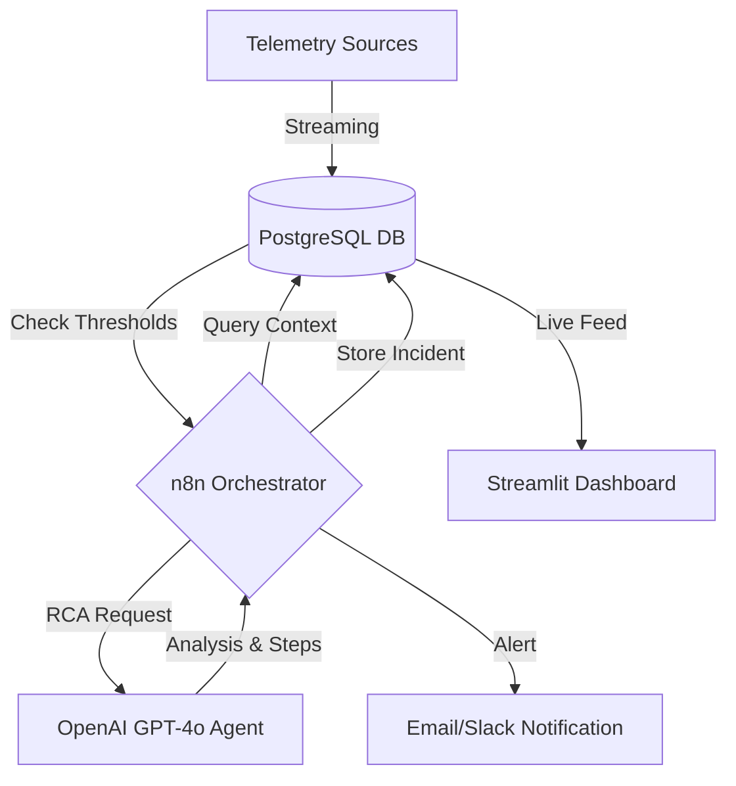
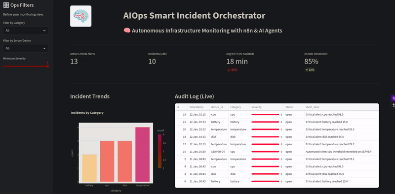

# 🤖 AIOps Smart Incident Orchestrator

  

**An autonomous infrastructure health-monitoring and diagnostic system powered by AI Agents and n8n.**

---

## 🚀 The Business Problem

- **Situation**: Modern Data Centers generate millions of telemetry points, leading to extreme **alert fatigue**. Critical infrastructure failures were often buried under thousands of low-priority logs, delaying response times and increasing operational risks.
- **Task**: To architect an autonomous system capable of filtering telemetry noise, performing real-time Root Cause Analysis (RCA), and dispatching actionable intelligence to on-site engineers—all while ensuring the environment is portable and scalable.
- **Action**: I orchestrated a multi-layered AIOps solution containerized with **Docker** for seamless deployment. I used **n8n** as the central engine, integrated **PostgreSQL** for time-series data, and leveraged **OpenAI's GPT-4o** to serve as an "AI Diagnostic Engineer" that contextually analyzes alerts and generates remediation plans.
- **Result**: Developed a production-ready framework that reduces initial diagnostic time from minutes to **seconds**, providing high-fidelity incident reports with 100% automated RCA coverage for critical failures.

---

## 🏗️ System Architecture

The system operates in three distinct layers to ensure reliability and intelligence:

1.  **Ingestion Layer**: Real-time metrics (CPU, Temp, Disk, UPS) are streamed into a **PostgreSQL** database.
2.  **Intelligence Layer (n8n + AI)**: 
    - **Monitor Workflow**: Polls for critical thresholds and triggers the AI Agent.
    - **AI Diagnostic**: GPT-4o receives the full context of the alert and performs a Root Cause Analysis (RCA).
3.  **Action Layer**: Results are pushed to an Executive Dashboard and dispatched via high-priority Gmail alerts with actionable remediation steps.

---

## ⚙️ How it Works: Workflow Deep Dive

### 1. The Monitor & Analyzer (`01-monitor.json`)
This is the heart of the system. Every 5 minutes, n8n queries the database for any device reporting a `critical` status. 
- **The Prompt**: The AI isn't just chatting; it's primed with a specific persona: *Senior Data Center Engineer*. 
- **The Output**: It generates a structured 3-point report: Root Cause, Business Impact, and a 3-step Remediation Plan.

### 2. The Alert Dispatcher (`02-Gmail-Alert-Dispatcher.json`)
Once an incident is analyzed, this workflow ensures the right people know immediately.
- **Smart Filtering**: Only alerts with a severity of 4/5 or higher trigger the emergency email.
- **Data Sanitization**: Uses custom **JavaScript** nodes to clean the AI output, formatting it into a beautiful, readable HTML email for mobile and desktop.

---

## 🖥️ Executive Dashboard

### System Demo

---

## 🛠️ Technology Stack
- **Orchestration**: [n8n](https://n8n.io/) (Low-code workflow automation)
- **Infrastructure**: [Docker](https://www.docker.com/) (Containerization for portable deployment)
- **Artificial Intelligence**: [OpenAI GPT-4o](https://openai.com/) (LLMs for RCA)
- **Database**: [PostgreSQL](https://www.postgresql.org/) (Structured incident logging)
- **Frontend**: [Streamlit](https://streamlit.io/) (Real-time monitoring UI)
- **Scripting**: Python 3.11 & JavaScript (Node.js)

---

## 📩 Contact & Collaboration
- **LinkedIn**: [daniel-garcía-belman-99a298aa](https://linkedin.com/in/daniel-garcía-belman-99a298aa)
- **Portfolio**: [danieljcvv-portfolio.vercel.app](https://danieljcvv-portfolio.vercel.app/)
- **Email**: [danielgb331@outlook.com](mailto:danielgb331@outlook.com)

---

*Developed by Daniel-jcVv | Powered by n8n, OpenAI & PostgreSQL*

**Soli Deo Gloria.**
