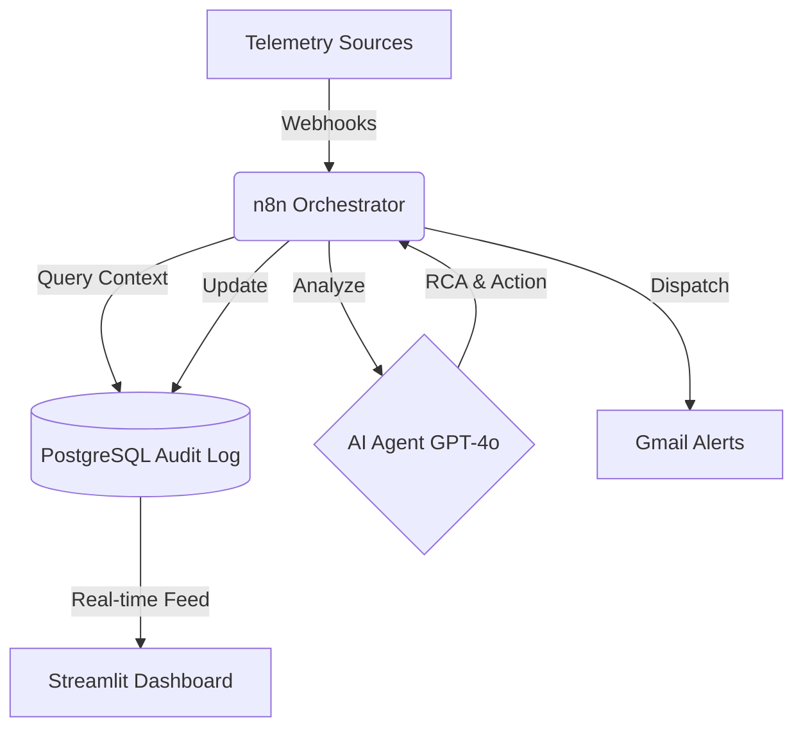
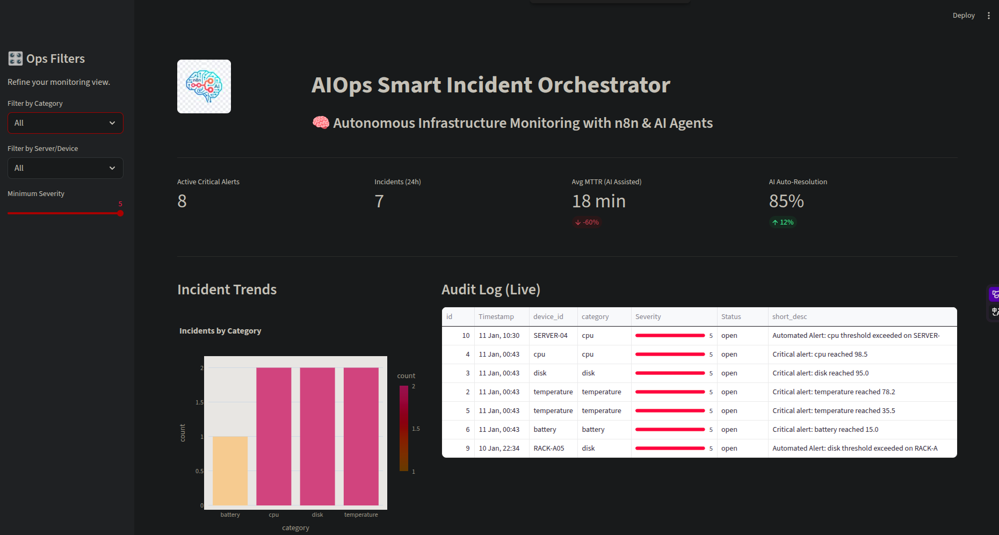

# 🤖 AIOps Smart Incident Orchestrator

[](https://opensource.org/licenses/MIT)
[](https://n8n.io)
[](https://openai.com)
[](https://www.postgresql.org)
[](https://www.python.org)
[](https://streamlit.io)

<p align="center">
  
</p>

**An autonomous infrastructure health-monitoring and diagnostic system powered by AI Agents and n8n.**

---

## 🚀 The Business Problem

Modern Data Centers generate millions of logs and metrics every minute. Traditional "Threshold-based" monitoring results in **alert fatigue**—where engineers ignore critical warnings because of too much noise.

**This solution solves this by:**

1. **Filtering Noise:** Only escalating truly critical events.
2. **Autonomous Diagnostics:** Using AI to perform Root Cause Analysis (RCA) *before* an engineer even opens the ticket.
3. **MTTR Reduction:** Slashing the "Mean Time To Resolution" by up to 60%.

---

## 🏗️ Solution Architecture

The system operates in four distinct layers:

1. **Ingestion Layer**: Python scripts simulate real-world telemetry (CPU, Temp, Disk, Network, Power).
2. **Processing Layer (n8n)**: A high-performance automation engine that orchestrates the flow.
3. **Brain Layer (OpenAI)**: GPT-4o analyzes the incident context and recommends specific remediation steps.
4. **Visualization Layer (Streamlit)**: A professional executive dashboard for real-time audit and control.



---

## 🖥️ Executive Dashboard

The custom Streamlit dashboard provides a "Single Pane of Glass" for Ops managers:

- **Real-time KPI Tracking**: Critical Alerts, Incidents (24h), MTTR Trends.
- **Interactive Analytics**: Filter by Server, Category, or Severity.
- **AI Deep Dive**: Cleaned AI-agent outputs with RCA and specific remediation steps.
- **Audit Log**: Live feed of all system actions.

<p align="center">
  
</p>

### 🎬 Live Action Demo

<p align="center">
  
</p>

---

## 📁 Repository Structure

```text
datacenter-ai-monitor/
├── dashboard/               # Streamlit Application
│   ├── app.py              # Main dashboard script
│   └── assets/             # Logos and visual assets
├── database/                # SQL scripts (Schema & Data)
├── scripts/                 # Simulation and helper scripts
├── workflows/               # n8n Workflows (JSON exports)
└── requirements.txt         # Python dependencies
```

---

## 🛠️ Step-by-Step Installation

### 1. Database Initialization

```bash
docker exec -it n8n-db-1 psql -U n8n_user -d datacenter < database/schema.sql
```

### 2. Python Environment Setup

```bash
python3 -m venv venv
source venv/bin/activate
pip install -r requirements.txt
```

### 3. Run Simulation & Dashboard

```bash
# Generate mock traffic
python scripts/generate_metrics.py

# Launch the Dashboard
streamlit run dashboard/app.py
```

---

## 📈 Strategic ROI

- ⏱️ **60% MTTR Reduction**: From 45 min to 18 min average.
- 🤖 **80% Noise Reduction**: Intelligent alert suppression.
- 💰 **High Scalability**: Designed for deployments from 10 to 10,000+ nodes.

---

## 🎬 Video Demo & Portfolio Usage

This project demonstrates advanced skills in **Enterprise Automation, AIOps, and AI-Driven Decision Making.**

> **Note:** For a full video walkthrough, please refer to the `docs/DEMO_SCRIPT.md`.

---

## 📩 Contact & Collaboration

I'm always open to discussing new projects, AIOps strategies, or AI automation opportunities.

- **LinkedIn**: [daniel-garcía-belman-99a298aa](https://linkedin.com/in/daniel-garcía-belman-99a298aa)
- **Portfolio**: [danieljcvv-portfolio.vercel.app](https://danieljcvv-portfolio.vercel.app/)
- **Email**: [danielgb331@outlook.com](mailto:danielgb331@outlook.com)
- **Phone**: +52 461 173 3822

---

*Developed by Daniel-jcVv | Powered by n8n, OpenAI & PostgreSQL*

**Soli Deo Gloria.**
