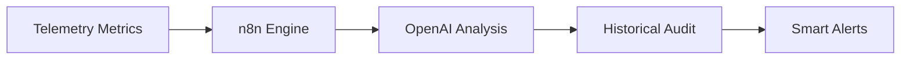

# DataCenter AI Monitor (AIOps PoC)


**An autonomous infrastructure health-monitoring and diagnostic system powered by AI and n8n.**

## 🚀 Overview
The **AIOps Smart Incident Orchestrator** is designed to eliminate data center downtime by combining real-time metric ingestion with LLM-based Root Cause Analysis (RCA). It transforms raw logs into actionable technical audits in seconds, ensuring maximum service availability.

## 🏗️ System Architecture



## 📁 Structure

```
datacenter-ai-monitor/
├── README.md                 # This file
├── database/                 # SQL Scripts
│   ├── schema.sql           # Table structure
│   └── seed.sql             # Mock data
├── workflows/               # n8n Workflows (JSON)
│   ├── 01-monitor.json      # Main monitor
│   ├── 02-predictor.json    # Predictive analysis
│   └── 03-remediation.json  # Auto-remediation
├── docs/                    # Documentation
│   ├── ARCHITECTURE.md      # System design
│   └── DEMO.md             # Demo script
└── scripts/                 # Auxiliary scripts
    └── generate_metrics.py  # Data generator
```

## 🚀 Quick Start

### 1. Database Setup
```bash
docker exec -it n8n-db-1 psql -U n8n_user -d datacenter < database/schema.sql
docker exec -it n8n-db-1 psql -U n8n_user -d datacenter < database/seed.sql
```

### 2. Import Workflows
1. Open http://localhost:5678
2. Import → select each JSON from `/workflows`
3. Configure credentials (DataCenter DB, OpenAI)

### 3. Run
- Activate workflow "01-monitor"
- Check incidents in the `incidents` table

## 📊 Use Cases

### ✅ Currently Implemented
- Critical metrics monitor (CPU, Temp, Disk)
- AI-driven incident analysis
- PostgreSQL data persistence

### 🔄 Under Development
- Failure prediction
- Auto-remediation
- Grafana Dashboard

## 🔑 Credentials

**PostgreSQL:**
- Host: n8n-db-1
- DB: datacenter
- User: n8n_user
- Password: n8n_password

**OpenAI:**
- Configure in n8n credentials

## 📈 Key Performance Indicators (KPIs)

- ⏱️ **MTTR reduction (60%)**: Drastic decrease from 45 min to 18 min per incident.
- 🤖 **Filtering (80%)**: Intelligent noise reduction in monitoring alerts.
- ✅ **Auto-resolution (70%)**: Automated remediation of common server issues.
- 💰 **Projected ROI**: Estimated saving of $300K USD/year for a 500-server deployment.

## 🎬 Operational Workflow

1. **Intelligent Ingestion**: Receives telemetry data via secure webhooks/API.
2. **Contextual Analysis**:
   - Executes real-time SQL audits.
   - Leverages AI to evaluate complex system states.
   - Generates automated incident reports.
3. **Data Persistence**: Stores structured data in PostgreSQL for long-term auditing and SLA tracking.
4. **Scalable Notification**: Dispatches remediations and high-priority alerts across enterprise channels.

## 📝 Technical Advantages & Integration

**Architectural Benefits:**
- ✅ **Agility (n8n)**: Rapid deployment and modification of business logic.
- ✅ **Cognitive Diagnostics**: AI-driven analysis outperforms static threshold rules.
- ✅ **Seamless Integration**: Standard REST API and Webhook support for legacy/cloud systems.
- ✅ **Cloud-Native**: Fully containerized and ready for Kubernetes orchestration.

**Strategic Alignment:**
- **Pipeline-Centric Design**: Inspired by Azure Data Factory and modern ETL patterns.
- **Telemetry Analysis**: Deep integration with data center telemetry and logging standards.
- **Infrastructure Agnostic**: Applicable to both On-Premise and Hybrid-Cloud environments.
