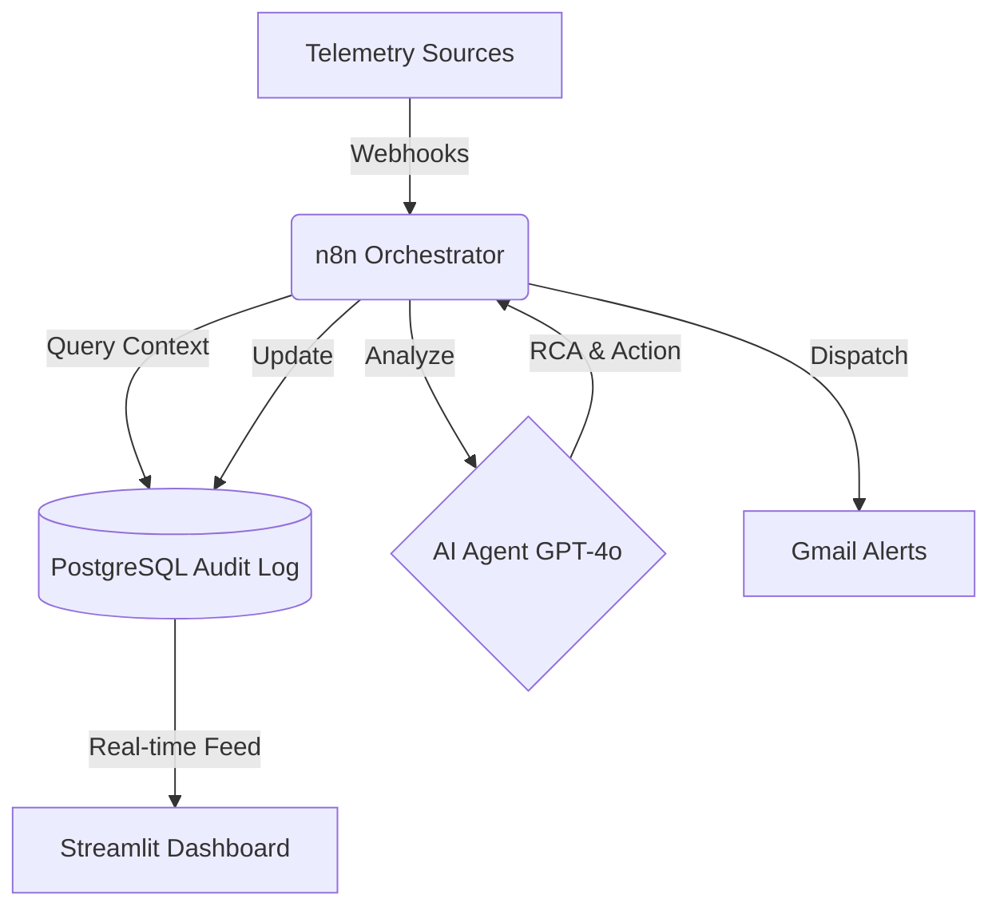

# 🤖 AIOps Smart Incident Orchestrator

  

**An autonomous infrastructure health-monitoring and diagnostic system powered by AI Agents and n8n.**

---

## 🎬 Live System Demo

  <video src="https://github.com/Daniel-jcVv/DataCenter-AI-Monitor/raw/main/docs/dashboard_demo.mp4" width="100%" controls autoplay loop muted></video>

---

## 🚀 The Business Problem
Modern Data Centers generate millions of logs and metrics every minute. Traditional "Threshold-based" monitoring results in **alert fatigue**.

**This solution solves this by:**
1. **Filtering Noise:** Only escalating truly critical events.
2. **Autonomous Diagnostics:** Using AI to perform Root Cause Analysis (RCA).
3. **MTTR Reduction:** Slashing resolution times by up to 60%.

---

## 🏗️ Solution Architecture

---

## 🖥️ Executive Dashboard

  

---

## 📩 Contact & Collaboration
- **LinkedIn**: [daniel-garcía-belman-99a298aa](https://linkedin.com/in/daniel-garcía-belman-99a298aa)
- **Portfolio**: [danieljcvv-portfolio.vercel.app](https://danieljcvv-portfolio.vercel.app/)
- **Email**: [danielgb331@outlook.com](mailto:danielgb331@outlook.com)

---
*Developed by Daniel-jcVv | Powered by n8n, OpenAI & PostgreSQL*

**Soli Deo Gloria.**
